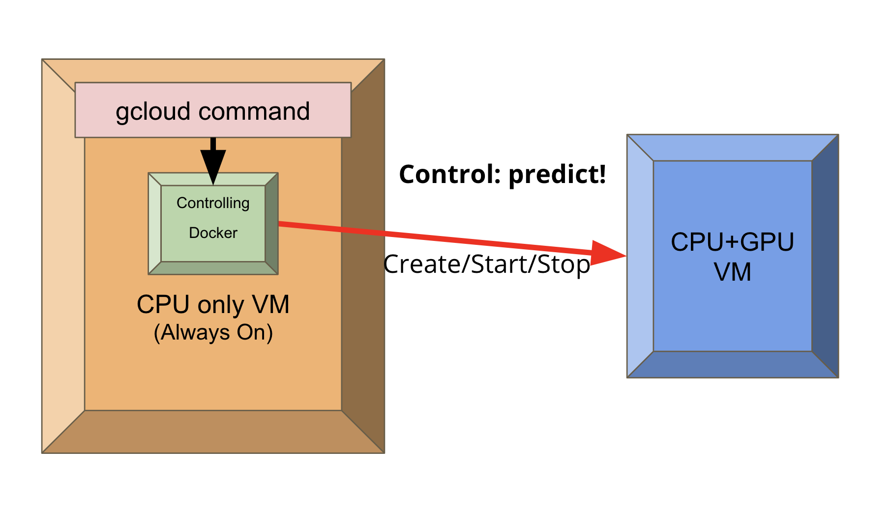

# rumors-ai-bert
Containerized BERT model for article categorizer

## Pipelines of rumors-ai-bert

1. Get articles needs to be classify in rumors-ai database.
2. Preprocess JSON response into CSV file for BERT model inputs
3. Send CSV file and prediction commands to GPU host
4. Read article classification results
5. Send classification results to cofacts rumors-ai host



## CPU host

The CPU host repo is mainly for user to build a service to:
  - Send tasks to GPU host
  - Control GPU host turn on/off (cost saving purpose)
  - Retrieve article classification results
  - Send results to cofacts rumors-ai host

### Build docker image

```bash
cd CPU_host
docker-compose up --build
```

### Image on Dockerhub

https://hub.docker.com/r/gary9630/rumors-ai-bert/tags


## GPU host

The GPU host repo is mainly for user to build a service to:
 - Train BERT models for pre-defined article classes/sub-classes
 - Classify articles sended from CPU host
